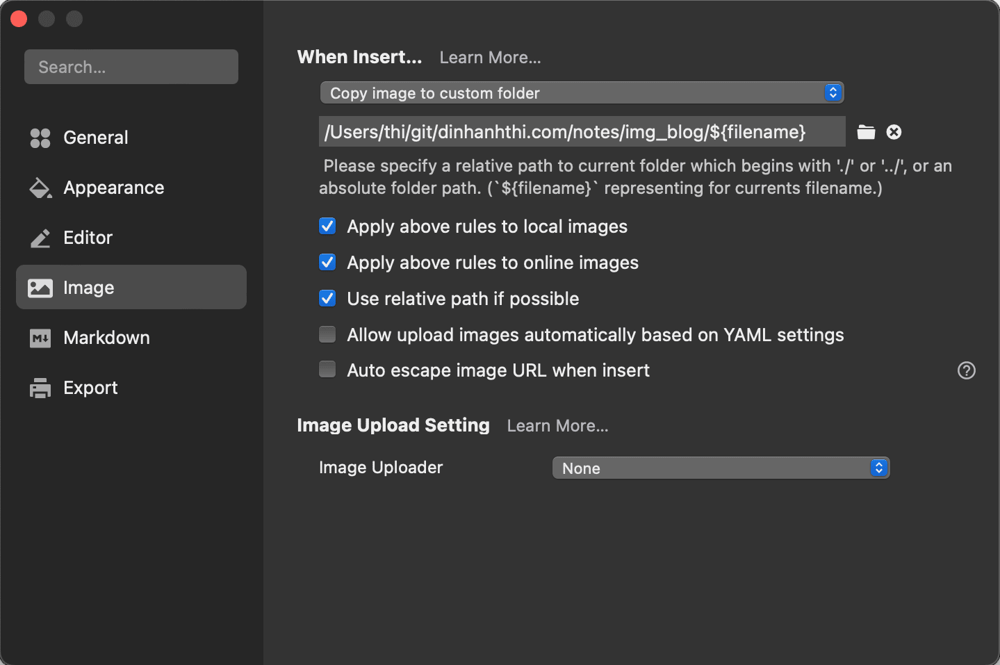

## 🎯 What we want?

- Capture the screen to the clipboard and then paste it into the editor. The captured image is automatically copied to a folder and can be viewed in the editor as well as on Github and on the 11ty website (after rendering).
- The same function for online images (copy and paste the URL).

## 🛠 Tools

You will need to install the following tools. Depending on your working style, you can choose one or both of them.

- [Typora](https://typora.io/) (WYSWYG).
- [VSCode](https://code.visualstudio.com/) (with extensions [Markdown All in One](https://marketplace.visualstudio.com/items?itemName=yzhang.markdown-all-in-one) and [Markdown Image](https://marketplace.visualstudio.com/items?itemName=hancel.markdown-image)).

## Setting up your project structure

Below is an example of the folder structure on my website. Read [this section](#why-it-works) to understand why this structure is important for all parts work together.

```bash
dinhanhthi.com
|- _built/ # The output folder (11ty renders markdown files to this) 
|- .eleventy.js
|- notes/
  |- blog/ # contains all markdown files
     |- 2022-06-25-name-of-post.md
  |- img_blog/ # contains all images
     |- 2022-06-25-name-of-post/ # the same name as markdown file
        |- figure-1.png
        |- figure-2.png

```

Some remarks,

- I put all the Markdown files and images in a folder called "notes", you do not have to do that. In other words, you can put the "blog" and "img_blog" folders in the root folder.
- The folder "2022-06-25-name-of-post" inside "img_blog" is automatically created by Typora or VScode (that's why I use them). But you can also create it manually if you want.

## Setting up `.eleventy`

You need to make 11ty recognize "blog" and "img_blog".

```js
module.exports = function (eleventyConfig) {
  // For images
  eleventyConfig.addPassthroughCopy({ "notes/img_blog": "img_blog" });
  
  return {
		// other settings
    dir: {
      input: ".",
      output: "_built",
    },
  };
}
```

## Setting up VSCode

Make sure you have the [Markdown All in One](https://marketplace.visualstudio.com/items?itemName=yzhang.markdown-all-in-one) and [Markdown Image](https://marketplace.visualstudio.com/items?itemName=hancel.markdown-image) extensions already installed.

Go to Makdown Image settings:

- In **Markdown-image > Local: Path**: `/img_blog/`.
- In **Markdown-mage > Base: File Name Format**: `${mdname}/${rand,100}`. Whenever you paste an image (from clipboard or from an URL) to a file `2022-06-25-name-of-post.md`, a new image file will be created at `img_blog/2022-06-25-name-of-post/<random-number>.png`

::: warning

A weakness of Markdown Image and Typora is that if you make changes in VSCode or Typora, an image that is automatically created in the folder you want cannot be changed. For example, if you change your mind and delete the line ``, the image in the folder "img_blog" is still there, you have to delete it manually!

:::

## Setting up Typora

Go to Typora Preferences and make the same settings as below,



## Why it works?{:#why-it-works}

::: info

 Based on how an [SSG](/tags/static-site-generators/) works, you can use the same idea in this post to get the same workflow for other [SSGs](/tags/static-site-generators/) other than [11ty](/tags/11ty/) ([Jekyll](/jekyll-tips/), Hugo, Gatsby,...).

:::

As you know, all rendered HTML files and images [must be stored in an output folder](https://www.11ty.dev/docs/config/), say `_built/` in my example. What you see on the website (in the html file) is

```html

```

and what you see in the Markdown editor is,

```markdown

```

They look the same, but in fact they are not. Let's check the folder `_built/`,

```bash
dinhanhthi.com
|- _built/
  |- name-of-post/
  |  |- index.html
  |- img_blog/
  |- 2022-06-25-name-of-post-name-of-post/
     |- name-of-image.png
```

Because in the `.eleventy.js`, we have set `addPassthroughCopy` from `notes/img_blog/` to `img_blog/`, we have `_built/img_blog/` after rendering.

It works in markdown editors (VSCode, Typora, Github,...) because **the relative path of the image to the markdown file** is `../img_blog/`.

Check again our project structure,

```bash
dinhanhthi.com
|- _built/
|- .eleventy.js
|- notes/
   |- blog/ 
      |- 2022-06-25-name-of-post.md
   |- img_blog/
      |- 2022-06-25-name-of-post/
         |- name-of-image.png
```

It works in the html file because **the relative path of the image to the `index.html` file** is `../img_blog/` too.

In short, you have to make sure that the relative path of the image to the markdown file is the same as the relative path of the image to the (rendered) `index.html` file.